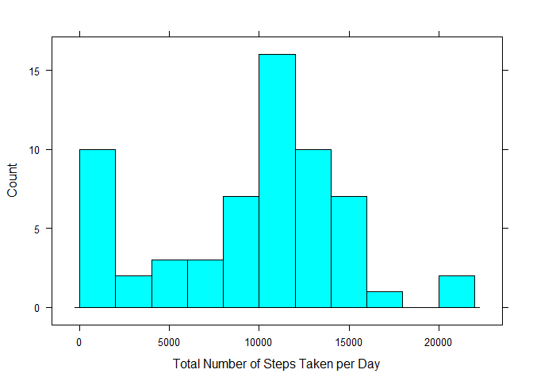
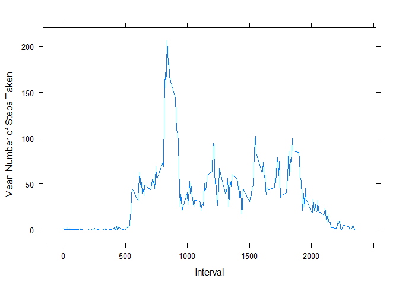
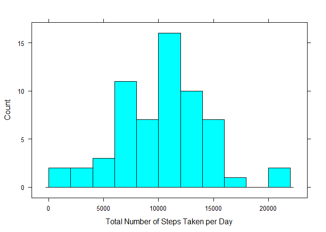
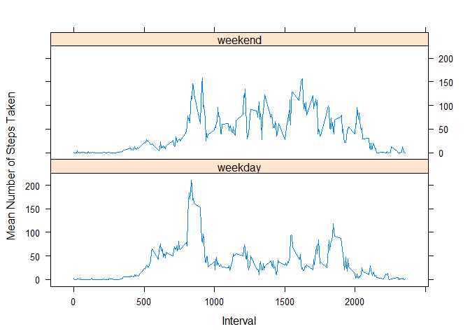

## Loading and preprocessing the data

```r
require(dplyr)
require(lattice)
stepData <- read.csv(".\\activity.csv", header = TRUE, colClasses = c(NA, "Date", NA))
```

## What is mean total number of steps taken per day?

```r
stepDataByDay <- summarize(group_by(stepData, date), steps = sum(steps, na.rm=TRUE))
histogram(~steps, data = stepDataByDay, breaks = 10, type = "count",
          xlab = "Total Number of Steps Taken per Day")
```

<!-- -->

```r
stepDataByDayMean <- round(mean(stepDataByDay$steps))
stepDataByDayMedian <- round(median(stepDataByDay$steps))
```

The mean total number of steps taken per day is 9354.

The median total number of steps taken per day is 10395.

## What is the average daily activity pattern?


```r
stepDataByInterval <- summarize(group_by(stepData, interval), steps = mean(steps, na.rm=TRUE))
xyplot(steps~interval, data = stepDataByInterval, type="l",
     xlab = "Interval",
     ylab = "Mean Number of Steps Taken")
```

<!-- -->

```r
stepDataByIntervalWhichMax <- stepDataByInterval$interval[which.max(stepDataByInterval$steps)]
```

The interval with the maximum number of steps taken per day is 835.

## Imputing missing values


```r
countMissingValues <- sum(!complete.cases(stepData))
```

The number of missing cases in the dataset is 2304.

Our strategy to fill in all the missing values will be to take the mean of values for that 5-minute interval.


```r
stepDataFilled <- stepData %>%
    mutate(steps = if_else(is.na(steps), stepDataByInterval[interval/5+1,2][[1]], as.double(steps)))
```


```r
stepDataFilledByDay <- summarize(group_by(stepDataFilled, date), steps = sum(steps, na.rm=TRUE))
histogram(~steps, data = stepDataFilledByDay, breaks = 10, type = "count",
          xlab = "Total Number of Steps Taken per Day")
```

<!-- -->

```r
stepDataFilledByDayMean <- round(mean(stepDataFilledByDay$steps))
stepDataFilledByDayMedian <- round(median(stepDataFilledByDay$steps))
```

The mean total number of steps taken per day is 10282. This is higher than the same number without data filling, which is expected since NA values were counted as 0 without filling and as a positive value with filling.

The median total number of steps taken per day is 10395. This is the exact same number as without data filling.

The distribution represented in the histogram with data filling looks more like a normal distribution, whereas the one without data filling had a strong skew due to 0 values.

## Are there differences in activity patterns between weekdays and weekends?


```r
weekDays <- weekdays(stepDataFilled$date)
stepDataFilled$day <- as.factor(
    if_else(weekDays == "Saturday" | weekDays == "Sunday",
            "weekend", "weekday"))
```


```r
stepDataFilledByInterval <- summarize(group_by(stepDataFilled, interval, day), steps = mean(steps, na.rm=TRUE))
xyplot(steps~interval|day, data = stepDataFilledByInterval, type="l",
     xlab = "Interval",
     ylab = "Mean Number of Steps Taken",
     layout = c(1,2))
```

<!-- -->
